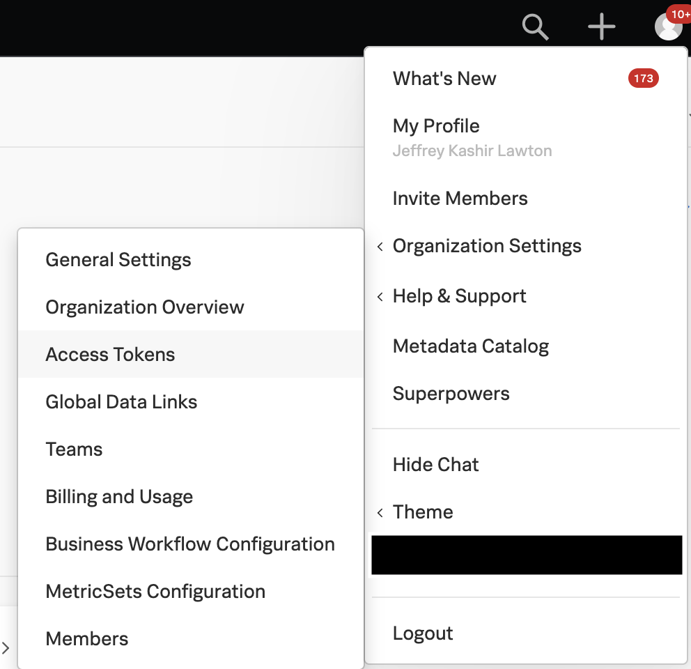
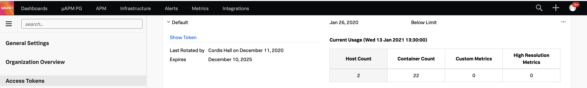
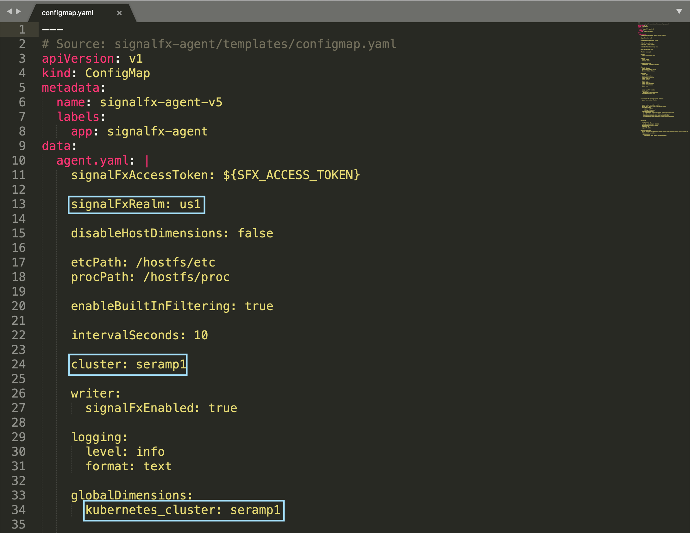
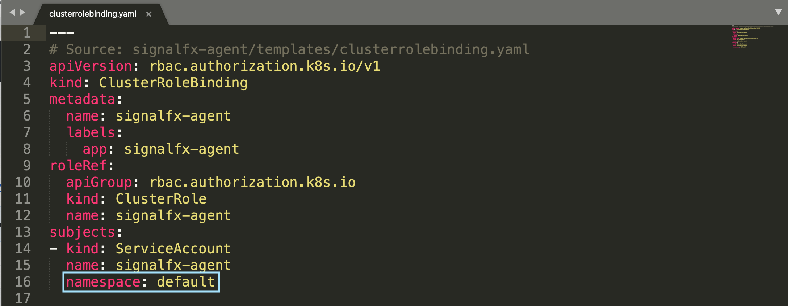

## Kubernetes Advanced Installation

Working config example based on the [Kubernetes Advanced Installation documentation](https://docs.signalfx.com/en/latest/integrations/kubernetes/k8s-advanced-installation.html#kubernetes-advanced-installation) of the Smart Agent.

# Instructions 
> Using [Minikube](https://minikube.sigs.k8s.io/docs/) v1.5.2 on Darwin 10.14.6

1. On the host(or server) that typically runs `kubectl`, run this command to create a Kubernetes secret (named `signalfx-agent`) containing your organization access token:

    `$ kubectl create secret generic --from-literal access-token=MY_ACCESS_TOKEN signalfx-agent`
    
    > Find Your Access Token
    > 1. Open the Settings menu at the far right of the navigation bar.
    > 2. Hover over Organization Settings, then select Access Tokens.
    > 3. To find an access token in a large list, start entering its name in the search box. Infrastructure Monitoring returns matching results.
    > 4. To look at the details for an access token, click the expand icon to the left of the token name.
    > 5. If you’re an organization administrator, the Actions menu appears at the right side of the token listing. You can select token actions from this menu.
    
    

    
    
    

2. Download these [configuration](https://github.com/jlawtonSFX/o11yseramp/tree/main/Week%202/Kubernetes%20Advanced%20Installation/K8s) files from the Github repository to the machine on which you usually run `kubectl`, and modify them as indicated.

- In `configmap.yaml`:
  - You need to assign a unique name to each Kubernetes cluster; choose a name and use a text editor to replace `seramp1` with the name you choose.
  - By default, the Smart Agent will send data to the `us0` realm. If you are not in this realm, you will need to explicitly set the `signalFxRealm` option in the agent configuration. To determine if you are in a different realm, check your profile page in the SignalFx web application.
  
    
  
- In clusterrolebinding.yaml, configmap-role.yaml, and configmap-rolebinding.yaml:
  - Change `default` or the service account token reference to the namespace in which you are deploying the agent. For example, cloudwatch.
  
    

3. Run this command on your Kubernetes cluster.

   `$ cat *.yaml | kubectl apply -f-`
  

